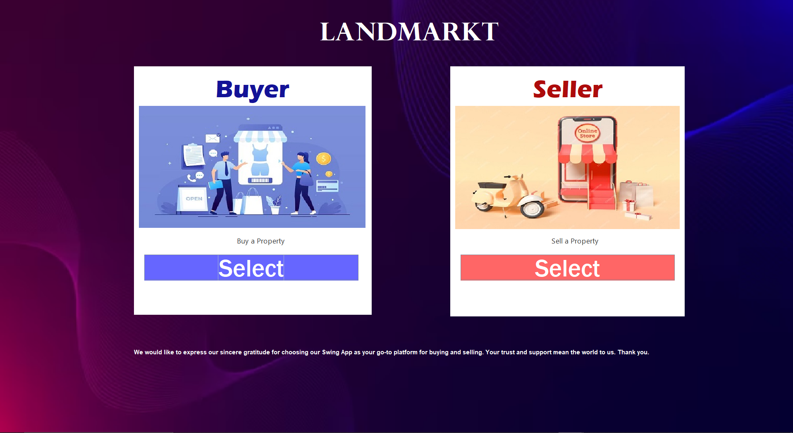
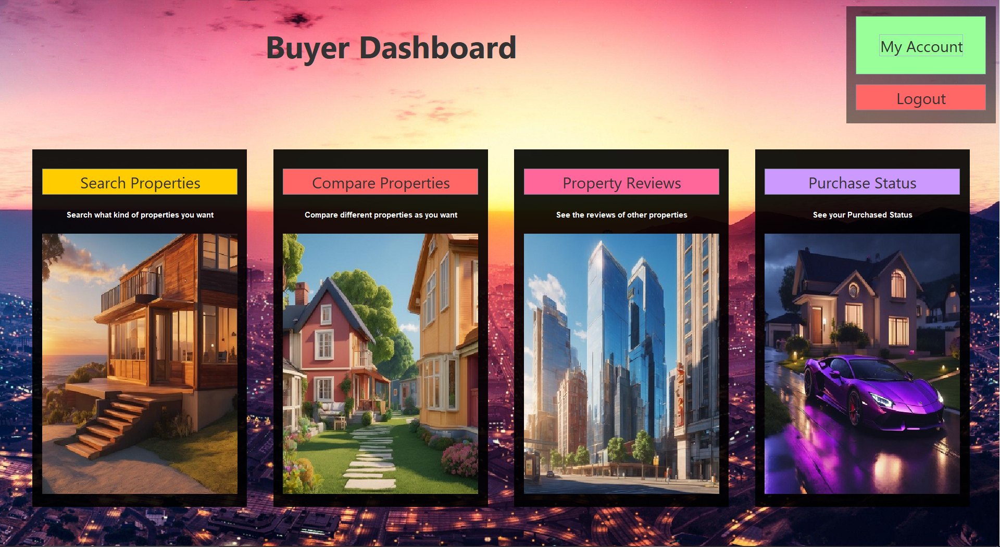
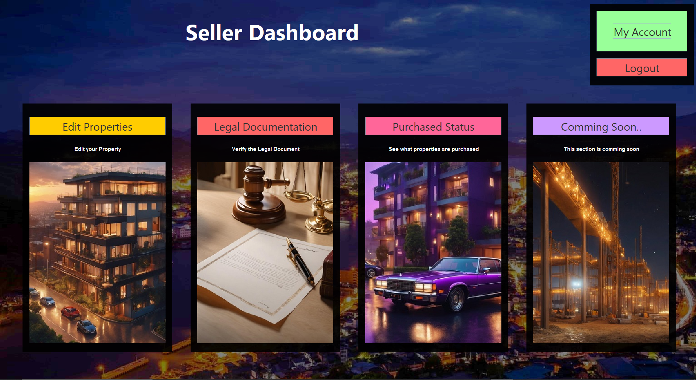

LandMarkt
LandMarkt is an innovative real estate platform that allows users to search for and post properties online. Whether you're looking to buy, sell, or rent, LandMarkt offers a user-friendly interface and powerful tools to help you navigate the real estate market.

Features
<ul>
  <li><b>Search Properties:</b> Find your ideal property by filtering based on location, price, type, and more.</li>
  <li><b>Post Listings:</b> Easily post your property for sale or rent with detailed descriptions and images.</li>
  <li><b>Property Details:</b> View comprehensive details about properties, including images, descriptions, and contact information.</li>
  <li><b>Compare Properties:</b> Compare multiple properties side-by-side to make informed decisions.</li>
  <li><b>User Authentication:</b> Secure user login and registration to manage your listings and favorites.</li>
</ul>
Technologies Used
<table>
  <tr>
    <td><b>Frontend:</b></td>
    <td>Java Swing (for desktop application)</td>
  </tr>
  <tr>
    <td><b>Backend:</b></td>
    <td>Java with MySQL</td>
  </tr>
  <tr>
    <td><b>Database:</b></td>
    <td>MySQL</td>
  </tr>
  <tr>
    <td><b>PDF Generation:</b></td>
    <td>iText PDF (for legal documentation)</td>
  </tr>
</table>
Installation
To get started with LandMarkt, follow these steps:

<ol>
  <li><b>Clone the repository:</b>
    <pre><code>git clone https://github.com/yourusername/LandMarkt.git</code></pre>
  </li>
  <li><b>Navigate to the project directory:</b>
    <pre><code>cd LandMarkt</code></pre>
  </li>
  <li><b>Set up the MySQL database:</b>
    <ul>
      <li>Create a new database named <code>landmarkt</code>.</li>
      <li>Import the provided SQL file to set up the tables and initial data.</li>
      <li>Update the database connection settings in the project to match your MySQL configuration.</li>
    </ul>
  </li>
  <li><b>Run the application:</b>
    <ul>
      <li>Compile the Java files and run the application using your preferred IDE or command line.</li>
    </ul>
  </li>
</ol>
Usage
<ul>
  <li><b>Search Properties:</b> Enter your desired criteria in the search bar and filter options to find properties that match your needs.</li>
  <li><b>Post Listings:</b> Navigate to the 'Post Property' section, fill in the required details, and upload images to create a new listing.</li>
  <li><b>Compare Properties:</b> Select multiple properties to compare their details side by side.</li>
  <li><b>Generate Legal Documents:</b> Use the 'Legal Documentation' feature to create PDFs of property details for contracts and agreements.</li>
</ul>

## Screenshots

  
  

Contributing

We welcome contributions to LandMarkt! To contribute:

<ol>
  <li>Fork the repository.</li>
  <li>Create a new branch:
    <pre><code>git checkout -b feature-branch</code></pre>
  </li>
  <li>Commit your changes:
    <pre><code>git commit -am 'Add new feature'</code></pre>
  </li>
  <li>Push to the branch:
    <pre><code>git push origin feature-branch</code></pre>
  </li>
  <li>Create a pull request.</li>
</ol>
License

This project is licensed under the MIT License. See the <a href="LICENSE">LICENSE</a> file for details.

Contact

For any questions or inquiries, please contact us at <a href="mailto:your.email@example.com">vedantdeore45@gmail.com</a>.

